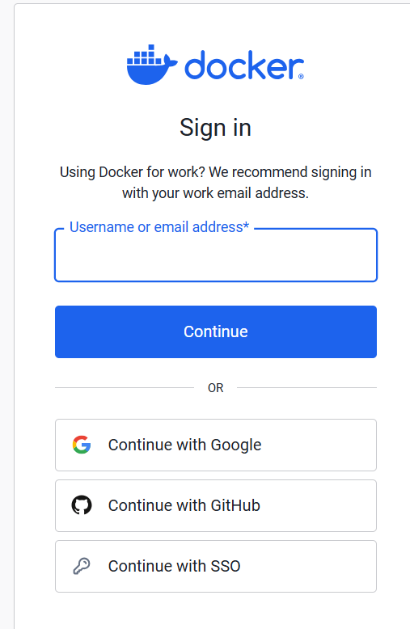
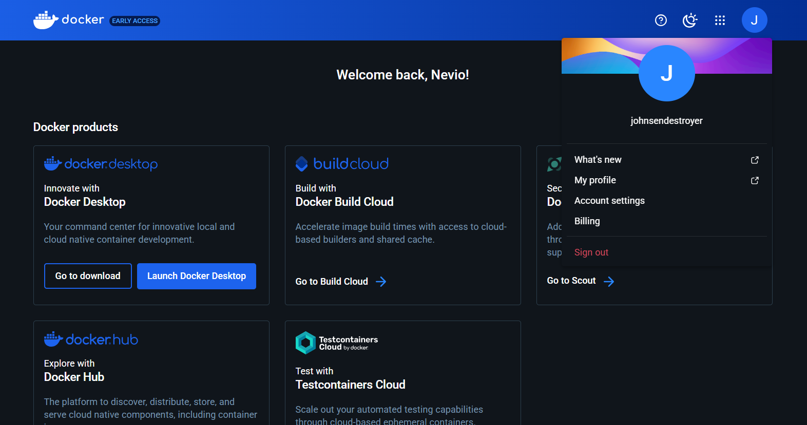

# Nevio's Docker Dokumentation #

Geschichte Von Docker

### Geschichte von Docker:
Docker wurde 2013 von Solomon Hykes ins Leben gerufen. Es revolutionierte die Software-Entwicklung, indem es Containerisierung für Anwendungen vereinfachte. Docker ermöglicht es, Anwendungen und ihre Abhängigkeiten in Containern zu verpacken, die überall konsistent ausgeführt werden können.

Cloud Computing Stack

### Cloud Computing Stack:
Ein Cloud-Computing-Stack umfasst verschiedene Dienste und Technologien, die zusammenarbeiten, um Cloud-basierte Lösungen bereitzustellen. Typischerweise beinhaltet dies Infrastruktur (wie virtuelle Maschinen), Plattformdienste (wie Datenbanken und Middleware) und Softwareanwendungen (wie SaaS-Angebote).

Unterschied Virtualisierung vs. Containerisierung

### Unterschied Virtualisierung vs. Containerisierung:
- Virtualisierung: Hier werden ganze virtuelle Maschinen (VMs) erstellt, die eine komplette Betriebssysteminstanz und Anwendungen beinhalten. Jede VM nutzt eine eigene Betriebssysteminstanz und Ressourcen.

- Containerisierung: Container teilen sich das Betriebssystem des Hosts und isolieren Anwendungen und deren Abhängigkeiten voneinander. Sie sind leichtgewichtiger als VMs und starten schneller, da sie den Overhead einer vollständigen Betriebssysteminstanz vermeiden.

Containerisierung, insbesondere durch Docker, hat die Bereitstellung von Anwendungen vereinfacht und die Effizienz in der Cloud-Computing-Welt erheblich verbessert.

>[!NOTE]
>Text wurde von ChatGPT geschrieben ich habe recherchiert ob alles stimmt und da ich fand das er es kurz und knackig erklärt habe ich seine Erklärung verwendet.

Docker Login

### Docker Login
Ich musste mich nicht registrieren da ich bereits ein Konto hatte also konnte ich mich 
einfach via Google einloggen.

Dannach war ich bereits auf meinem Konto eingelogged.

