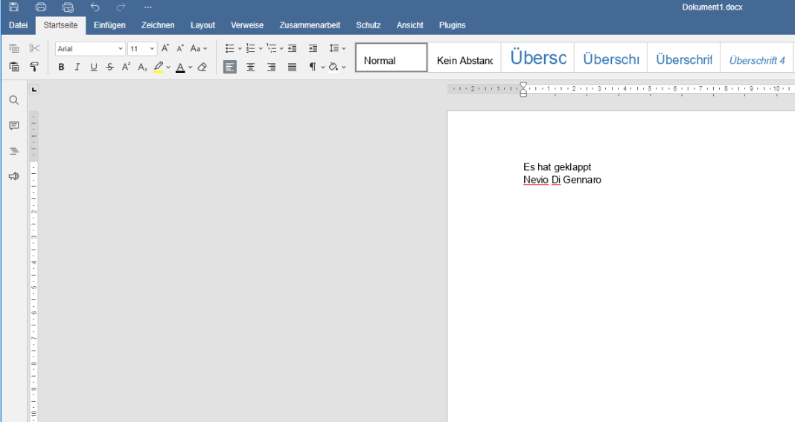
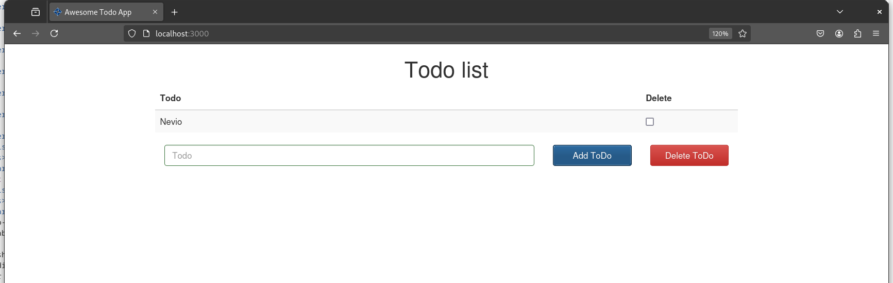
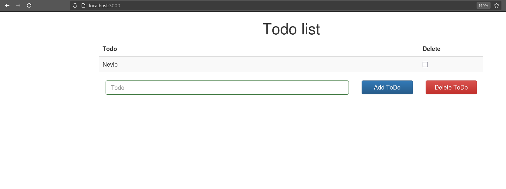
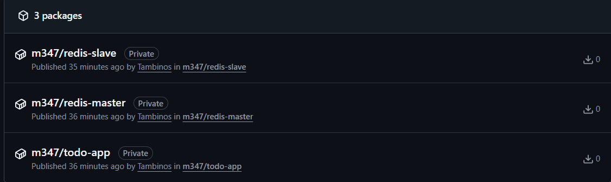
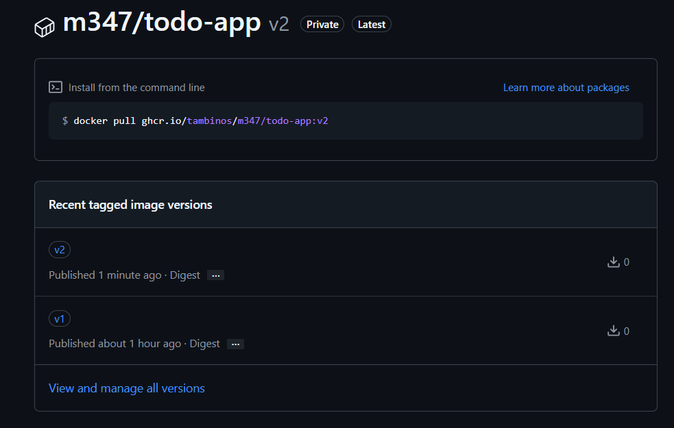
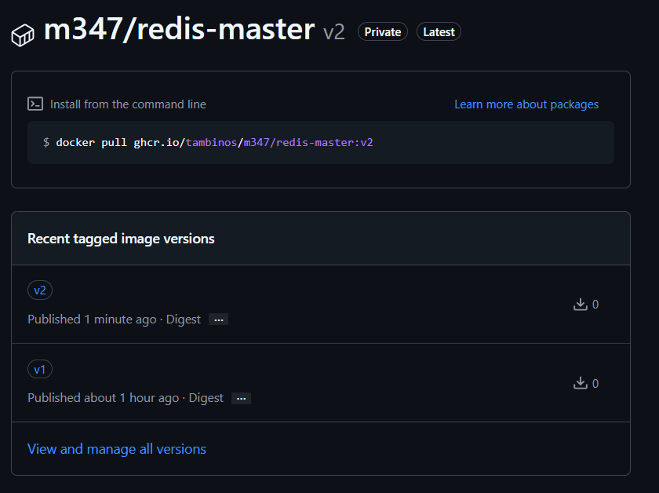
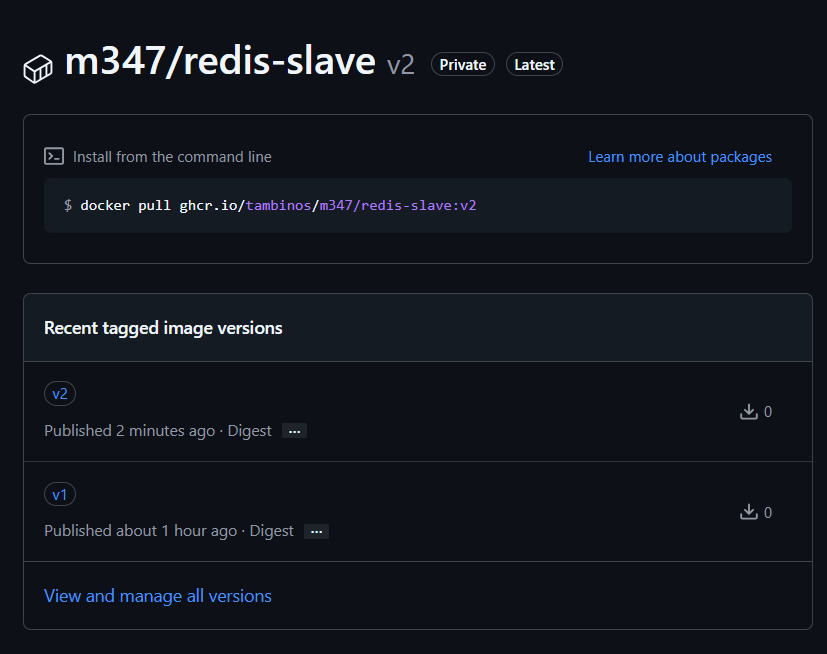
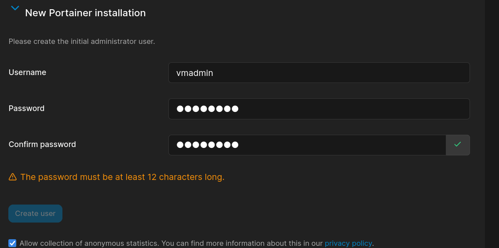
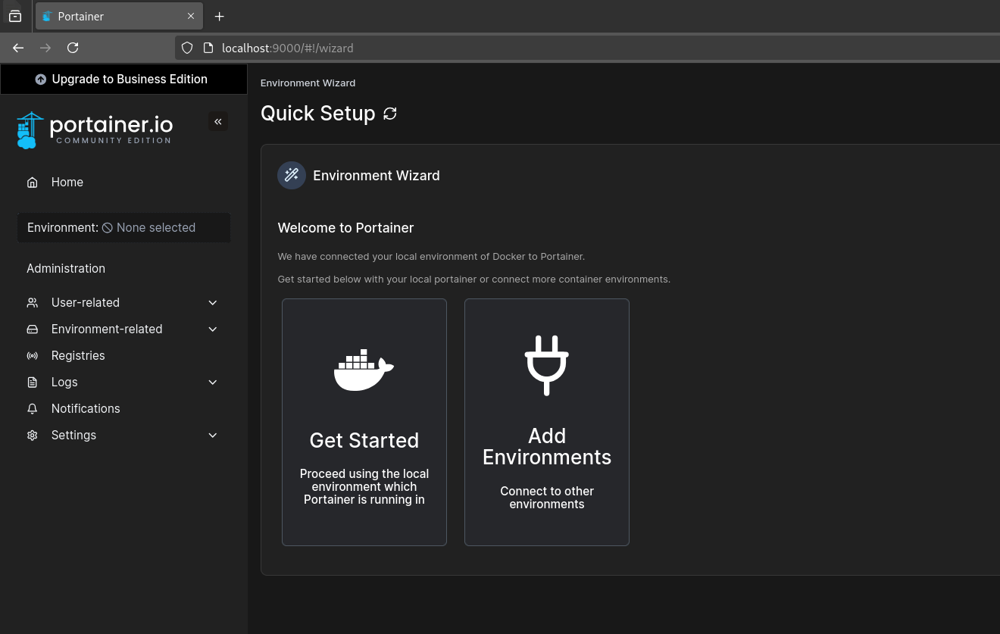

# Nevio's Docker Dokumentation #
INF2023I
M347
V1
")

<details>
<summary>Für was sind Docker-Container nützlich? S.1</summary>
<h3>Für was sind Docker-Container nützlich?</h3>
Docker-Container sind nützlich, weil sie eine isolierte, konsistente Umgebung bieten, die es Entwicklern und Systemadministratoren ermöglicht, Anwendungen unabhängig von der zugrunde liegenden Infrastruktur auszuführen. Hier sind einige Hauptvorteile und Einsatzmöglichkeiten von Docker-Containern:

- Portabilität
- Konsistenz zwischen Entwicklungs-, Test- und Produktionsumgebungen
- Skalierbarkeit und Flexibilität
- Ressourcen-Effizienz
</details>
<details>
<summary>Was ist Dev-Ops? S.2</summary>
<h3>Was ist Dev-Ops?</h3>
DevOps ist eine Abkürzung für "Development" (Entwicklung) und "Operations" (Betrieb). Es handelt sich um eine kulturelle und praktische Herangehensweise an Softwareentwicklung und IT-Betrieb, die darauf abzielt, die Zusammenarbeit zwischen Entwicklern (die neue Funktionen entwickeln) und Operations-Teams (die für die Bereitstellung und den reibungslosen Betrieb der Software verantwortlich sind) zu verbessern.
</details>
<details>
<summary>Unterschied Virtualisierung vs. Containerisierung S.3</summary>
<h3>Unterschied Virtualisierung vs. Containerisierung</h3>

- Virtualisierung: Hier werden ganze virtuelle Maschinen (VMs) erstellt, die eine komplette Betriebssysteminstanz und Anwendungen beinhalten. Jede VM nutzt eine eigene Betriebssysteminstanz und Ressourcen.

- Containerisierung: Container teilen sich das Betriebssystem des Hosts und isolieren Anwendungen und deren Abhängigkeiten voneinander. Sie sind leichtgewichtiger als VMs und starten schneller, da sie den Overhead einer vollständigen Betriebssysteminstanz vermeiden.

Containerisierung, insbesondere durch Docker, hat die Bereitstellung von Anwendungen vereinfacht und die Effizienz in der Cloud-Computing-Welt erheblich verbessert.
</details>

>[!NOTE]
>Die oberen Texte wurden von ChatGPT geschrieben ich habe recherchiert ob alles stimmt und da ich fand das er es kurz und knackig erklärt habe ich seine Erklärung verwendet.
<details>
<summary>Docker Login S.4</summary>
<h3>Docker Login</h3>
Ich musste mich nicht registrieren da ich bereits ein Konto hatte also konnte ich mich 
einfach via Google einloggen.


Dannach war ich bereits auf meinem Konto eingelogged.


</details>
<details>
<summary>Unterschied Container und Image S.5</summary>
<h3>Unterschied Container und Image</h3>

  - Docker-Image: Ein Image ist wie eine Vorlage, die verwendet wird, um Container zu erstellen. Die Anweisungen zum Erstellen eines Docker-Containers enthält. Ein Image enthält alles, was notwendig ist, um eine Anwendung auszuführen – wie Code, Laufzeitumgebung, Bibliotheken, Umgebungsvariablen und Konfigurationsdateien.
<br></br>
- Docker-Container: Ein Container ist eine laufende Instanz eines Images. Er erstellt das benötigte Environment um eine Anwendung und ihre Abhängigkeiten zu erfüllen dies so resourcensparend wie möglich. Container, die aus demselben Image erstellt werden, sind hinsichtlich ihrer Konfiguration und ihres Verhaltens identisch.

Kurz gesagt: Ein Image ist die Vorlage für den Container
</details>
<details>
<summary>Wichtigste Befehle für Docker S.6</summary>
<h3>Wichtigste Befehle für Docker</h3>
  
- `docker --version` Zeigt die aktuelle Version von Docker an.

- `docker pull <image-name>` Lädt ein Docker-Image aus einem Repository (z. B. Docker Hub) herunter.

- `docker build -t <image-name> <path>` Erstellt ein Docker-Image aus einem
Dockerfile im angegebenen Verzeichnis.

- `docker run <options> <image-name>` Startet einen neuen Container basierend auf einem Image. Du kannst auch Optionen wie Portweiterleitungen, Umgebungsvariablen oder Volumes hinzufügen.

- `docker ps` Listet alle laufenden Container auf.

- `docker ps -a` Listet alle Container auf, einschließlich der gestoppten.

- `docker stop <container-id>` Stoppt einen laufenden Container.

- `docker rm <container-id>` Löscht einen gestoppten Container.

- `docker rmi <image-name>` Löscht ein Docker-Image.
  
- `docker logs <container-id>` Zeigt die Logs eines Containers an.
</details>
<details>
  <summary>OnlyOffice Installation S.7</summary>
   
</details>
<details>
  <summary>To-Do App Images builden und runnen S.8</summary>
  <h3>To-Do App Images builden und runnen</h3>
  Ich habe die Images gebaut und gerunnt mit diesen Befehlen
  <br></br>
  V1
  
  ```bash
  cd redis-slave/
  docker build -t redis-slave:v1 .
  cd ..
  cd redis-master/
  docker build -t redis-master:v1 .
  cd ..
  cd web-frontend/
  docker build -t todo-app:v1 .
  docker network create todoapp_network
  docker run --net=todoapp_network --name=redis-master -d redis-master:v1
  docker run --net=todoapp_network --name=redis-slave -d redis-slave:v1
  docker run --net=todoapp_network --name=frontend -d -p 3000:3000 todo-app:v1
  ```
  <br></br>
  V2  
  ```bash
  cd to-do-appv1/
  cd redis-slave/
  docker build -t redis-slave:v2 .
  cd ..
  cd redis-master/
  docker build -t redis-master:v2 .
  cd ..
  cd to-do-appv2/
  ls
  cd web-frontendv2/
  docker build -t todo-app:v2 .
  docker network create todoapp_network
  docker run --net=todoapp_network --name=redis-master -d redis-master:v2
  docker run --net=todoapp_network --name=redis-slave -d redis-slave:v2
  docker run --net=todoapp_network --name=frontend -d -p 3000:3000 todo-app:v2
  ```
  Mit diesem Befehlen ist die app schon gelaufen
  <br></br>
  V1
  
  <br></br>
  V2 
  
</details>
<details>
  <summary>To-Do App Images pushen S.9</summary>
  <h3>To-Do App Images pushen</h3>
  Mit diesen Befehlen habe ich die BIlder in mein registry gepushed (v1 und v2 gleicher prozess einfach in der anderen Directory und die tags zu v2 ändern)
  
  ```bash
  docker login ghcr.io
  docker image tag redis-master:v1 ghcr.io/tambinos/m347/redis-master:v1
  docker image tag redis-slave:v1 ghcr.io/tambinos/m347/redis-slave:v1
  docker image tag todo-app:v1 ghcr.io/tambinos/m347/todo-app:v1
  docker image push ghcr.io/tambinos/m347/todo-app:v1
  docker image push ghcr.io/tambinos/m347/redis-master:v1
  docker image push ghcr.io/tambinos/m347/redis-slave:v1
  ```
  Mit diesem Befehlen war das ganze auch schon gepusht
  
  
  
  
</details>
<details>
  <summary>Was ist Docker Compose S.10</summary>
  <h3>Was ist Docker Compose</h3>
  Docker Compose bietet mehrere Vorteile um den Run Prozess von Images zu vereinfachen indem sie folgende Vorteile bieten

  -  Mehrere Container in der richtigen Reihenfolge starten
  -  Networking normalerweise sollten alle Container im gleichen Network operieren was konfiguration ersparrt

  Dadurch können wir mehrere Images sehr einfach handlen.

</details>
<details>
  <summary>Docker compose für Todo-app-v2 S.11</summary>
  <h3>Docker compose für Todo-app-v2</h3>
  Wir erstellen ein neues file mit
  
  ```
  touch docker-compose.yml
  ```
  
  In dieses kommt nun unser docker-compose	
  
  ```
version: '3'
  services:
    redis-master:
      image: ghcr.io/tambinos/m347/redis-master:v2
      container_name: redis-master
      ports:
        - "6379:6379"

    redis-slave:
      image: ghcr.io/tambinos/m347/redis-slave:v2
      container_name: redis-slave
      depends_on:
        - redis-master
      ports:
        - "6380:6379"

    todo-app:
      image: ghcr.io/tambinos/m347/todo-app:v2
      container_name: todo-app
      depends_on:
        - redis-master
      ports:
        - "3000:3000"
  ```

  Dieses können wir jetzt mit ausführen

  ```
  docker compose up
  ```
</details>
<details>
  <summary>Portainer installation S.12</summary>
  <h3>Portainer installation</h3>
  Portainer installations Befehl

  ```
  docker volume create portainer_data
  docker run -d -p 9000:9000 --name portainer --restart always -v /var/run/docker.sock:/var/run/docker.sock -v portainer_data:/data portainer/portainer-ce
  sudo systemctl restart docker
  docker restart portainer
  ```

  Dannach regristrieren
  
  Und schon ist man fertig
  

  
</details>
<details>
  <summary>Portainer app installation S.13</summary>
</details>
