# Nevio's Docker Dokumentation #
INF2023I
M347
V1
")

<details>
<summary>Für was sind Docker-Container nützlich? S.1</summary>
<h3>Für was sind Docker-Container nützlich?</h3>
Docker-Container sind nützlich, weil sie eine isolierte, konsistente Umgebung bieten, die es Entwicklern und Systemadministratoren ermöglicht, Anwendungen unabhängig von der zugrunde liegenden Infrastruktur auszuführen. Hier sind einige Hauptvorteile und Einsatzmöglichkeiten von Docker-Containern:

- Portabilität
- Konsistenz zwischen Entwicklungs-, Test- und Produktionsumgebungen
- Skalierbarkeit und Flexibilität
- Ressourcen-Effizienz
</details>
<details>
<summary>Was ist Dev-Ops? S.2</summary>
<h3>Was ist Dev-Ops?</h3>
DevOps ist eine Abkürzung für "Development" (Entwicklung) und "Operations" (Betrieb). Es handelt sich um eine kulturelle und praktische Herangehensweise an Softwareentwicklung und IT-Betrieb, die darauf abzielt, die Zusammenarbeit zwischen Entwicklern (die neue Funktionen entwickeln) und Operations-Teams (die für die Bereitstellung und den reibungslosen Betrieb der Software verantwortlich sind) zu verbessern.
</details>
<details>
<summary>Unterschied Virtualisierung vs. Containerisierung S.3</summary>
<h3>Unterschied Virtualisierung vs. Containerisierung</h3>

- Virtualisierung: Hier werden ganze virtuelle Maschinen (VMs) erstellt, die eine komplette Betriebssysteminstanz und Anwendungen beinhalten. Jede VM nutzt eine eigene Betriebssysteminstanz und Ressourcen.

- Containerisierung: Container teilen sich das Betriebssystem des Hosts und isolieren Anwendungen und deren Abhängigkeiten voneinander. Sie sind leichtgewichtiger als VMs und starten schneller, da sie den Overhead einer vollständigen Betriebssysteminstanz vermeiden.

Containerisierung, insbesondere durch Docker, hat die Bereitstellung von Anwendungen vereinfacht und die Effizienz in der Cloud-Computing-Welt erheblich verbessert.
</details>

>[!NOTE]
>Die oberen Texte wurden von ChatGPT geschrieben ich habe recherchiert ob alles stimmt und da ich fand das er es kurz und knackig erklärt habe ich seine Erklärung verwendet.
<details>
<summary>Docker Login S.4</summary>
<h3>Docker Login</h3>
Ich musste mich nicht registrieren da ich bereits ein Konto hatte also konnte ich mich 
einfach via Google einloggen.

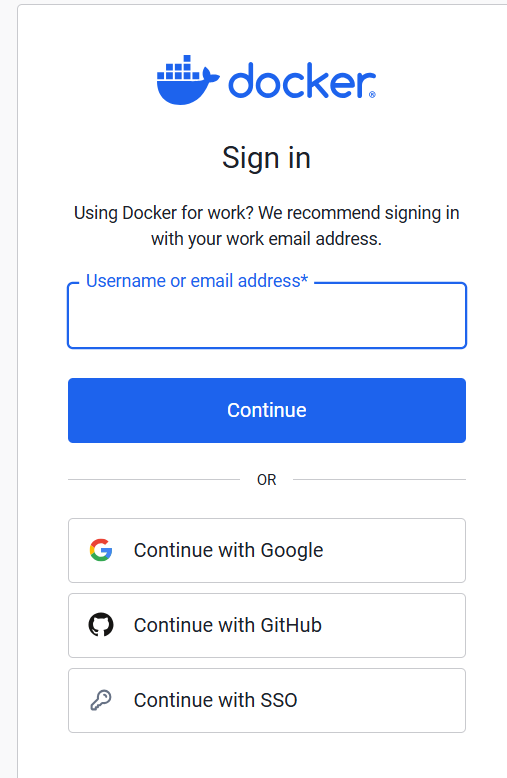

Dannach war ich bereits auf meinem Konto eingelogged.

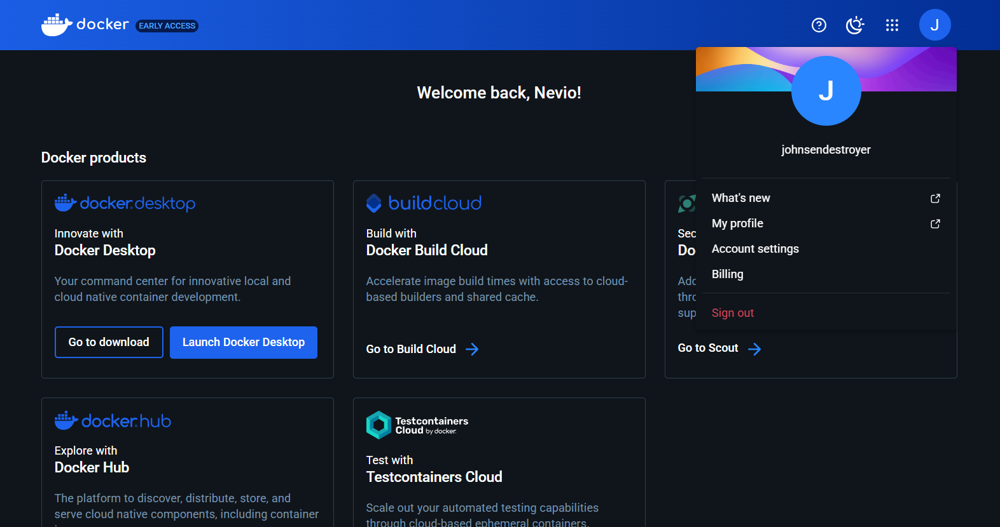
</details>
<details>
<summary>Unterschied Container und Image S.5</summary>
<h3>Unterschied Container und Image</h3>

  - Docker-Image: Ein Image ist wie eine Vorlage, die verwendet wird, um Container zu erstellen. Die Anweisungen zum Erstellen eines Docker-Containers enthält. Ein Image enthält alles, was notwendig ist, um eine Anwendung auszuführen – wie Code, Laufzeitumgebung, Bibliotheken, Umgebungsvariablen und Konfigurationsdateien.
<br></br>
- Docker-Container: Ein Container ist eine laufende Instanz eines Images. Er erstellt das benötigte Environment um eine Anwendung und ihre Abhängigkeiten zu erfüllen dies so resourcensparend wie möglich. Container, die aus demselben Image erstellt werden, sind hinsichtlich ihrer Konfiguration und ihres Verhaltens identisch.

Kurz gesagt: Ein Image ist die Vorlage für den Container
</details>
<details>
<summary>Wichtigste Befehle für Docker S.6</summary>
<h3>Wichtigste Befehle für Docker</h3>
  
- `docker --version` Zeigt die aktuelle Version von Docker an.

- `docker pull <image-name>` Lädt ein Docker-Image aus einem Repository (z. B. Docker Hub) herunter.

- `docker build -t <image-name> <path>` Erstellt ein Docker-Image aus einem
Dockerfile im angegebenen Verzeichnis.

- `docker run <options> <image-name>` Startet einen neuen Container basierend auf einem Image. Du kannst auch Optionen wie Portweiterleitungen, Umgebungsvariablen oder Volumes hinzufügen.

- `docker ps` Listet alle laufenden Container auf.

- `docker ps -a` Listet alle Container auf, einschließlich der gestoppten.

- `docker stop <container-id>` Stoppt einen laufenden Container.

- `docker rm <container-id>` Löscht einen gestoppten Container.

- `docker rmi <image-name>` Löscht ein Docker-Image.
  
- `docker logs <container-id>` Zeigt die Logs eines Containers an.
</details>
<details>
  <summary>OnlyOffice Installation S.7</summary>
   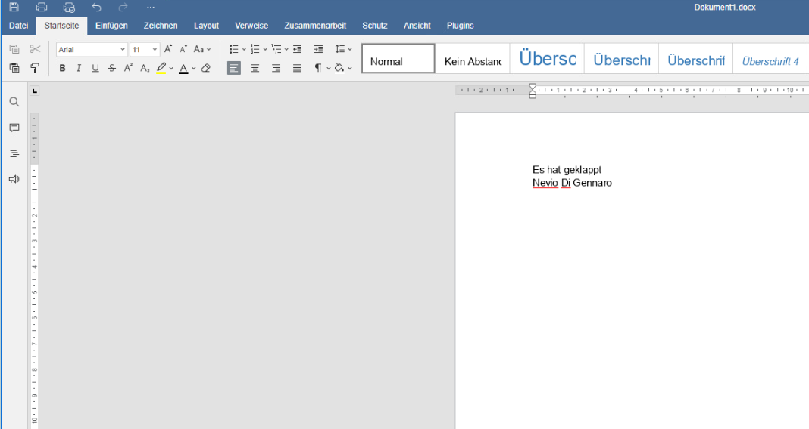
</details>
<details>
  <summary>To-Do App Images builden und runnen S.8</summary>
  <h3>To-Do App Images builden und runnen</h3>
  Ich habe die Images gebaut und gerunnt mit diesen Befehlen
  <br></br>
  V1
  
  ```bash
  cd redis-slave/
  docker build -t redis-slave:v1 .
  cd ..
  cd redis-master/
  docker build -t redis-master:v1 .
  cd ..
  cd web-frontend/
  docker build -t todo-app:v1 .
  docker network create todoapp_network
  docker run --net=todoapp_network --name=redis-master -d redis-master:v1
  docker run --net=todoapp_network --name=redis-slave -d redis-slave:v1
  docker run --net=todoapp_network --name=frontend -d -p 3000:3000 todo-app:v1
  ```
  <br></br>
  V2  
  ```bash
  cd to-do-appv1/
  cd redis-slave/
  docker build -t redis-slave:v2 .
  cd ..
  cd redis-master/
  docker build -t redis-master:v2 .
  cd ..
  cd to-do-appv2/
  ls
  cd web-frontendv2/
  docker build -t todo-app:v2 .
  docker network create todoapp_network
  docker run --net=todoapp_network --name=redis-master -d redis-master:v2
  docker run --net=todoapp_network --name=redis-slave -d redis-slave:v2
  docker run --net=todoapp_network --name=frontend -d -p 3000:3000 todo-app:v2
  ```
  Mit diesem Befehlen ist die app schon gelaufen
  <br></br>
  V1
  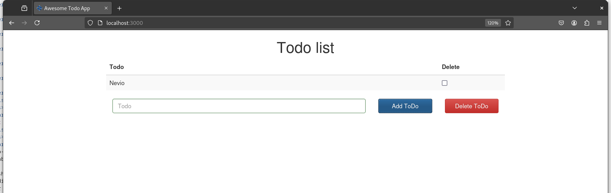
  <br></br>
  V2 
  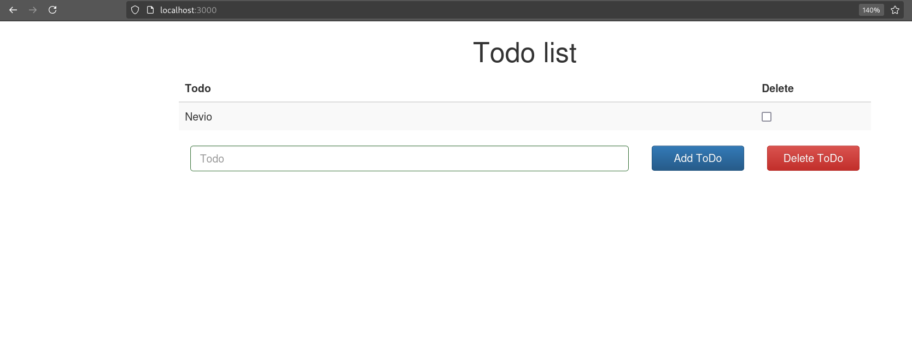
</details>
<details>
  <summary>To-Do App Images pushen S.9</summary>
  <h3>To-Do App Images pushen</h3>
  Mit diesen Befehlen habe ich die BIlder in mein registry gepushed (v1 und v2 gleicher prozess einfach in der anderen Directory und die tags zu v2 ändern)
  
  ```bash
  docker login ghcr.io
  docker image tag redis-master:v1 ghcr.io/tambinos/m347/redis-master:v1
  docker image tag redis-slave:v1 ghcr.io/tambinos/m347/redis-slave:v1
  docker image tag todo-app:v1 ghcr.io/tambinos/m347/todo-app:v1
  docker image push ghcr.io/tambinos/m347/todo-app:v1
  docker image push ghcr.io/tambinos/m347/redis-master:v1
  docker image push ghcr.io/tambinos/m347/redis-slave:v1
  ```
  Mit diesem Befehlen war das ganze auch schon gepusht
  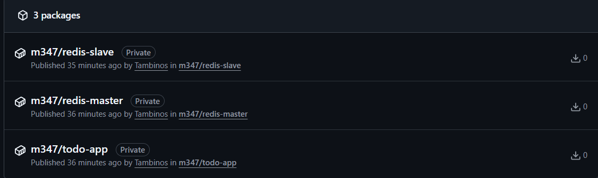
  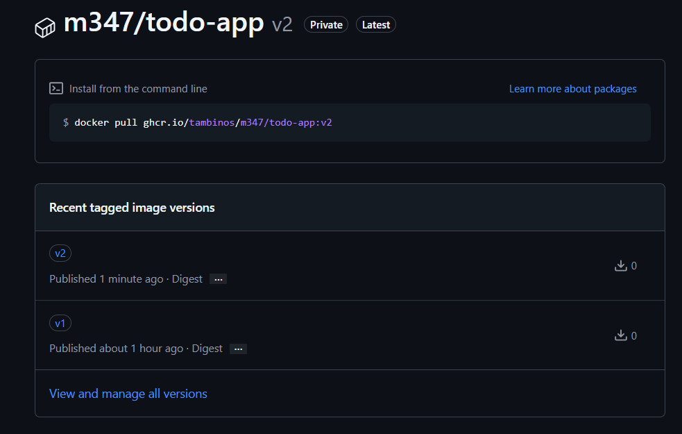
  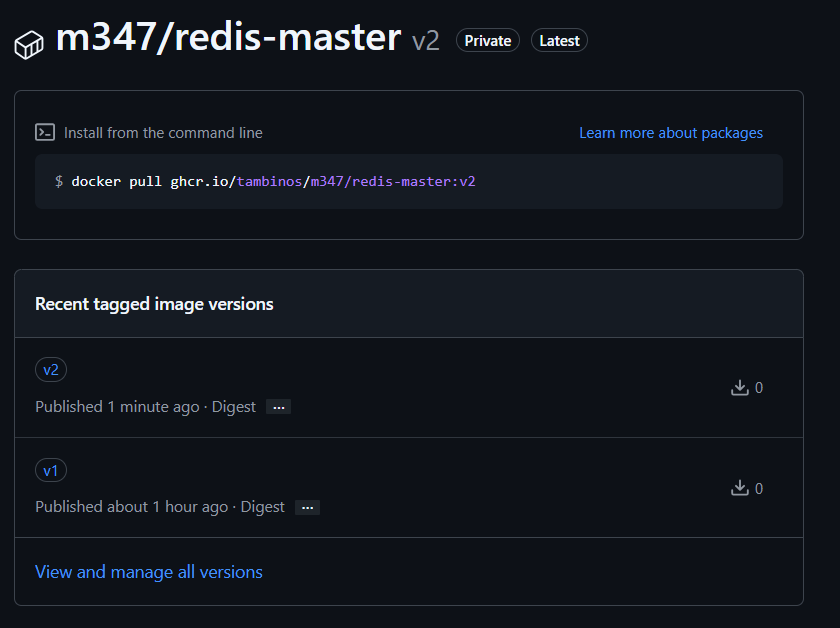
  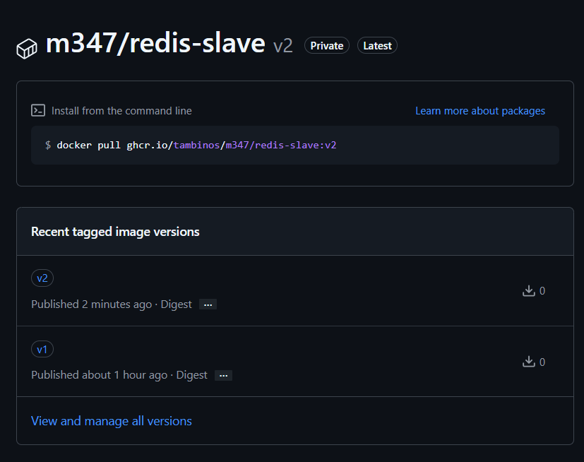
</details>
<details>
  <summary>Was ist Docker Compose S.10</summary>
  <h3>Was ist Docker Compose</h3>
  Docker Compose bietet mehrere Vorteile um den Run Prozess von Images zu vereinfachen indem sie folgende Vorteile bieten

  -  Mehrere Container in der richtigen Reihenfolge starten
  -  Networking normalerweise sollten alle Container im gleichen Network operieren was konfiguration ersparrt

  Dadurch können wir mehrere Images sehr einfach handlen.

</details>
<details>
  <summary>Docker compose für Todo-app-v2 S.11</summary>
  <h3>Docker compose für Todo-app-v2</h3>
  Wir erstellen ein neues file mit
  
  ```
  touch docker-compose.yml
  ```
  
  In dieses kommt nun unser docker-compose	
  
  ```
version: '3'
  services:
    redis-master:
      image: ghcr.io/tambinos/m347/redis-master:v2
      container_name: redis-master
      ports:
        - "6379:6379"

    redis-slave:
      image: ghcr.io/tambinos/m347/redis-slave:v2
      container_name: redis-slave
      depends_on:
        - redis-master
      ports:
        - "6380:6379"

    todo-app:
      image: ghcr.io/tambinos/m347/todo-app:v2
      container_name: todo-app
      depends_on:
        - redis-master
      ports:
        - "3000:3000"
  ```

  Dieses können wir jetzt mit ausführen

  ```
  docker compose up
  ```
</details>
<details>
  <summary>Portainer installation S.12</summary>
  <h3>Portainer installation</h3>
  Portainer installations Befehl

  ```
  docker volume create portainer_data
  docker run -d -p 9000:9000 --name portainer --restart always -v /var/run/docker.sock:/var/run/docker.sock -v portainer_data:/data portainer/portainer-ce
  sudo systemctl restart docker
  docker restart portainer
  ```

  Dannach regristrieren
  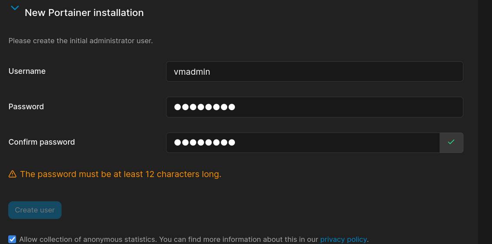
  Und schon ist man fertig
  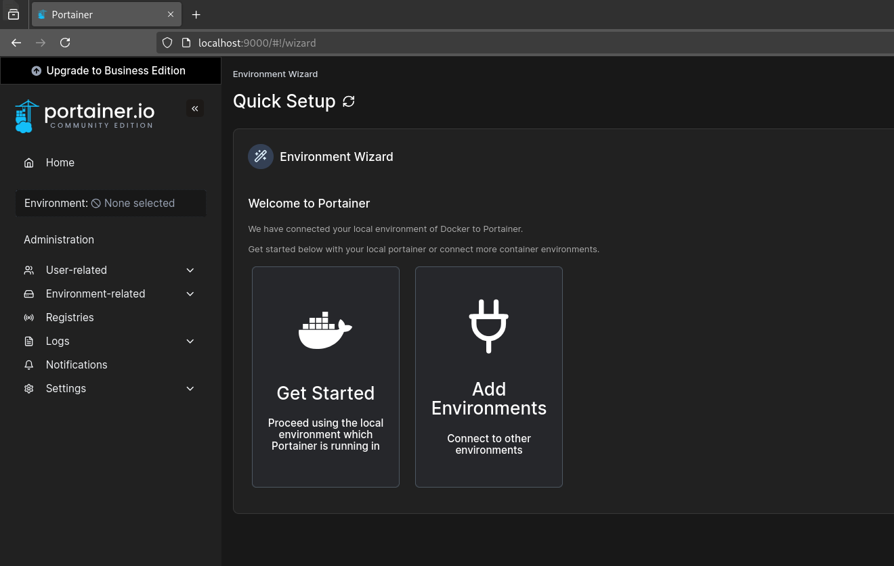

  
</details>
<details>
  <summary>Portainer app installation S.13</summary>
  <h3>Portainer app installation</h3>

  Repository als stack hinzufügen
  
  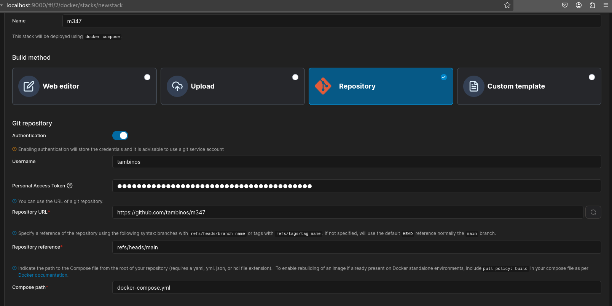
  Und schon sollten die container runnen
  
  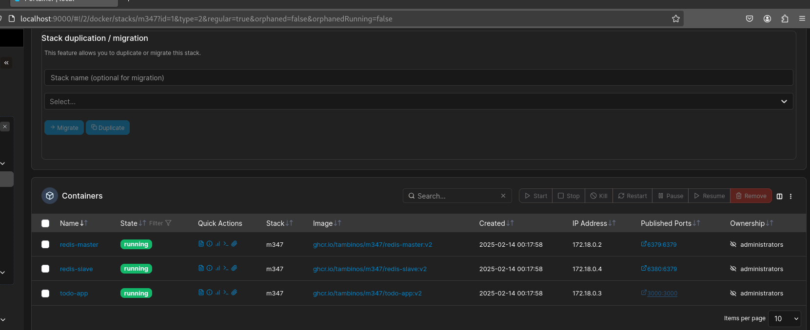
</details>
<details>
  <summary>Beispiel Shop installation S.14</summary>
  <h3>Beispiel Shop installation</h3>

  Repository clonen und .git ordner removen damit wir nicht ein git in einem git haben  
  ```
  git clone git@git.gibb.ch:thomas.staub/microservices.git
  rm -rf microservices/.git
  ```
  
  In die docker directory um das docker-compose zu starten und etc/hosts bearbeiten
  ```
  nano /etc/hosts #folgende linie hinzufügen => 127.0.0.1       host.docker.internal
  cd microservices/Play.Infra/docker
  docker compose up
  ```
  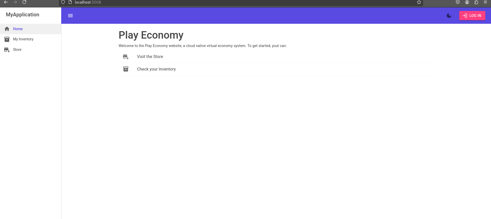
  
  Prometheus, Jaeger und Grafana
  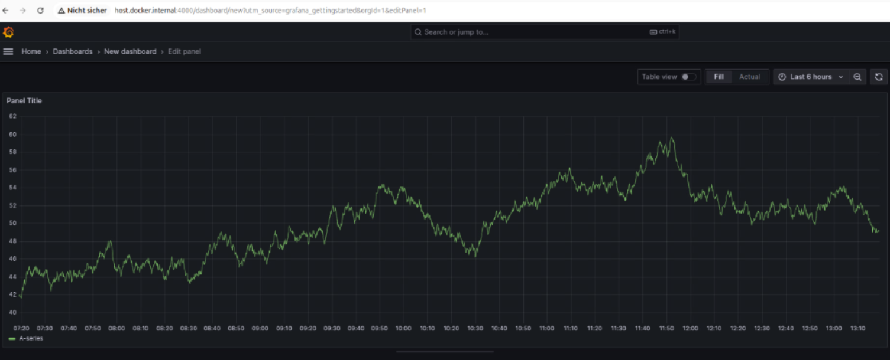
  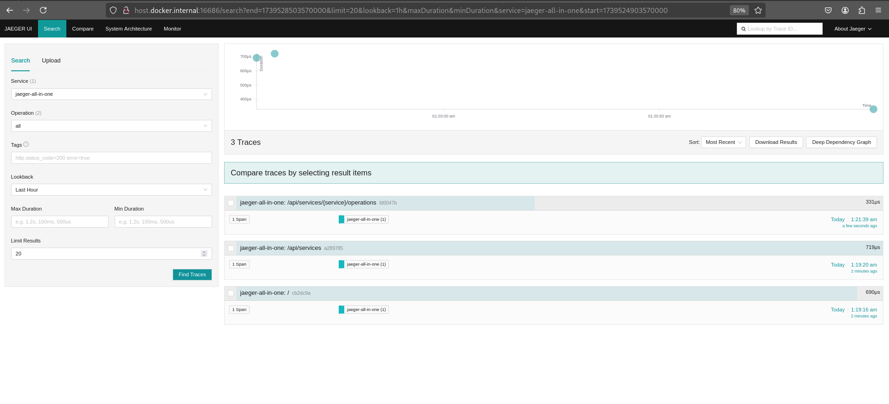
  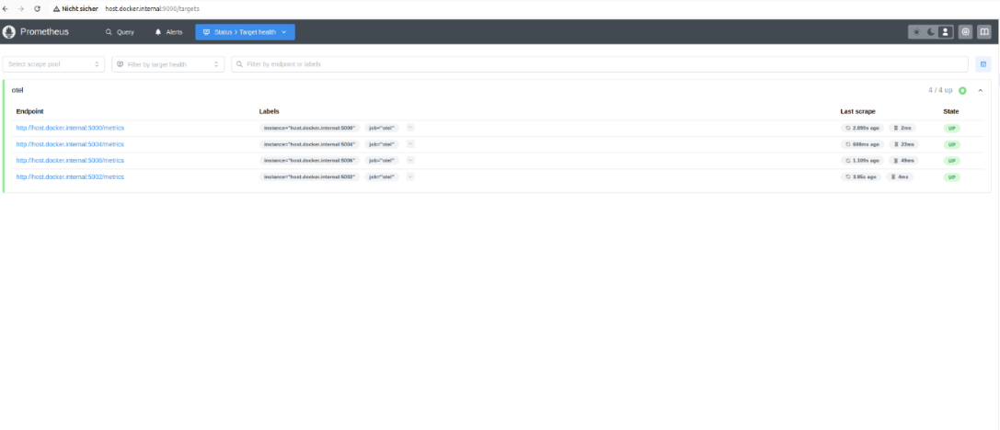

</details>
<details>
<summary>Raft-Konsens-Algorithmus S.15</summary>
<h3>Raft-Konsens-Algorithmus</h3>

Der **Raft-Konsens-Algorithmus** ist ein Protokoll zur Konsensbildung in verteilten Systemen. Es stellt sicher, dass alle Server eines Clusters denselben Zustand haben, indem ein **Leader** gewählt wird, der Schreiboperationen koordiniert. Die verbleibenden **Follower** replizieren den Zustand und akzeptieren Änderungen nur vom aktuellen Leader. Sollte dieser ausfallen, wird ein neuer Leader durch eine Abstimmung gewählt. Um eine **Split-Brain-Situation** zu vermeiden, sollte ein Raft-Cluster immer eine **ungerade Anzahl von Servern** haben, sodass Abstimmungen immer eine klare Mehrheit ergeben.
</details>

<details>
<summary>Betrieb der App in Kubernetes S.16</summary>
<h3>Betrieb der App in Kubernetes</h3>
Deployment App mit Kubernetes

Version 1
``` 
kubectl create -f redis-master-controller.yaml -n to-do-app
kubectl get pods -n to-do-app
kubectl create -f redis-master-service.yaml -n to-do-app
kubectl get service -n to-do-app
kubectl create -f redis-slave-controller.yaml -n to-do-app 
kubectl get rc -n to-do-app
kubectl get pods -n to-do-app
kubectl create -f redis-slave-service.yaml -n to-do-app 
kubectl get service -n to-do-app
kubectl create -f redis-slave-controller.yaml -n to-do-app 
kubectl create -f todo-app-deploy.yaml -n to-do-app
kubectl create -f todo-app-service-deploy.yaml -n to-do-app 
kubectl get deployments -n to-do-app
kubectl get pods -l app=todo-app -n to-do-app
kubectl get rc -n to-do-app
kubectl get po -n to-do-app
kubectl get svc -n to-do-app
kubectl get endpoints -n to-do-app
kubectl get services -n to-do-app
```
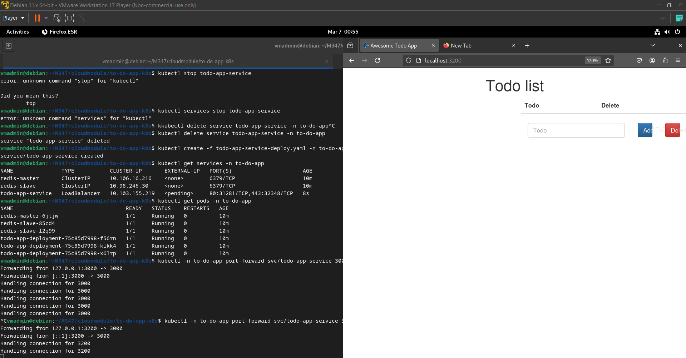

Version 2 
```
kubectl apply -f todo-app-deploy-v2.yaml -n to-do-app
```
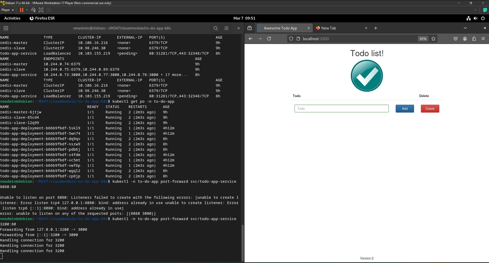
Da alles andere schon läuft reicht dieser Befehl

</details>

<details>
<summary>Self-Healing in Kubernetes S.17</summary>
<h3>Self-Healing in Kubernetes</h3>

Kubernetes bietet eine **Self-Healing-Funktion**, die sicherstellt, dass fehlerhafte oder abgestürzte Pods automatisch neu gestartet werden. Dies geschieht durch **Liveness-Probes**, die den Zustand der Anwendung kontinuierlich überprüfen. Falls ein Pod nicht mehr reagiert, beendet Kubernetes diesen und startet einen neuen Pod. Dies minimiert Ausfallzeiten und sorgt für eine **hohe Verfügbarkeit** der Anwendung. Durch Self-Healing müssen Administratoren nicht manuell eingreifen, wenn ein Problem auftritt.
</details>

<details>
<summary>Scale Up & Scale Down S.18</summary>
<h3>Scale Up</h3>

```bash
# Scale Up
kubectl scale deployment todo-app --replicas=5

# Scale Down
kubectl scale deployment school-system --replicas=2
```
Scale Up bedeutet, dass zusätzliche Instanzen (Pods) der Anwendung erstellt werden, um eine höhere Last zu bewältigen. Kubernetes verteilt die neuen Pods automatisch auf verfügbare Nodes, um die Performance zu verbessern. Dies geschieht dynamisch, sodass bei einem Anstieg der Last automatisch zusätzliche Ressourcen bereitgestellt werden können. Durch einfaches Anpassen der Replikas kann Kubernetes horizontal skalieren, um den Anforderungen gerecht zu werden. Diese Methode wird oft bei stark frequentierten Anwendungen genutzt, um eine gleichbleibende Nutzererfahrung zu gewährleisten.
</details>
<details>
<summary>Blue-Green Deployment S.19</summary>
<h3>Blue-Green Deployment</h3>
Blue-Green Deployment ist eine Strategie für den Deployment-Prozess von Software, bei der zwei identische Produktionsumgebungen parallel betrieben werden: eine "Blue" Umgebung (die aktuelle Live-Umgebung) und eine "Green" Umgebung (die neue Version, die aktualisiert werden soll). 
Bei einem Blue-Green Deployment wird die neue Version der Anwendung in der Green-Umgebung bereitgestellt und vollständig getestet, während die Blue-Umgebung weiterhin in Produktion bleibt und den laufenden Betrieb unterstützt.
Sobald die Green-Umgebung erfolgreich getestet wurde und bereit ist, wird der Verkehr von der Blue- zur Green-Umgebung umgeschaltet, indem die Router oder Load Balancer einfach neu konfiguriert werden.
Diese Methode ermöglicht ein nahezu nahtloses Rollback auf die vorherige Version, falls Probleme auftreten, da die Blue-Umgebung intakt bleibt und sofort wieder aktiviert werden kann.
Blue-Green Deployment reduziert das Risiko von Ausfallzeiten und Störungen für Endbenutzer erheblich, indem es eine geprüfte und stabile Umgebung während des Update-Prozesses aufrechterhält.
</details>
<details>
<summary>Eintrag zu Cluster IP und Node IP S.20</summary>
<h3>Eintrag zu Cluster IP und Node IP</h3>

**Cluster IP**:
- **Definition**: Eine interne virtuelle IP-Adresse, die von Kubernetes für Services bereitgestellt wird. Sie ist nur innerhalb des Clusters erreichbar.
- **Funktion**: Dient als Load Balancer für die Pods eines Services.
- **Lebenszyklus**: Wird beim Erstellen eines Services zugewiesen und beim Löschen des Services freigegeben.

**Node IP**:
- **Definition**: Die IP-Adresse eines physischen oder virtuellen Knotens im Kubernetes-Cluster.
- **Funktion**: Ermöglicht den Zugriff auf Services außerhalb des Clusters über den NodePort.
- **NodePort**: Ein Port, der auf allen Knoten geöffnet wird und den Service extern verfügbar macht.

**Unterschiede**:
- Cluster IP ist intern und Node IP ist extern erreichbar.
- Cluster IP dient als interner Load Balancer, Node IP ermöglicht externen Zugriff.

</details>

<details>
<summary>Eintrag zu Load Balancer S.21</summary>
<h3>Eintrag zu Load Balancer</h3>

**Definition**: Ein Load Balancer verteilt den eingehenden Datenverkehr auf mehrere Pods, um die Verfügbarkeit und Skalierbarkeit zu erhöhen.

**Arten von Load Balancern**:
- **Service Load Balancer**: Von Kubernetes verwaltet, für Services vom Typ LoadBalancer.
- **Ingress Controller**: Software-Load-Balancer, der den Traffic basierend auf Regeln an Services weiterleitet.
- **Externe Load Balancer**: Hardware- oder Software-Load-Balancer außerhalb des Clusters.

**Funktionsweise**:
- Verteilung des Traffics durch Algorithmen wie Round Robin, Least Connections oder IP-Hash.

**Vorteile**:
- Erhöhte Verfügbarkeit und verbesserte Skalierbarkeit.
- Bessere Leistung durch Traffic-Verteilung auf weniger ausgelastete Pods.

</details>

<details>
<summary>PrintScreen Wie Sie auf die App zugreiffen. Siehe Kap. Ingress S.22</summary>
<h3>PrintScreen Wie Sie auf die App zugreiffen. Siehe Kap. Ingress</h3>

(Hier würde ein Screenshot eingefügt werden, der den Zugriff auf die Anwendung über Ingress zeigt. Da ich kein Bild direkt anzeigen kann, beschreibe ich, was darauf zu sehen wäre)

**Inhalt des Screenshots**:
- Browser-Adresse: Eine URL, die auf den Hostnamen der Anwendung verweist (z.B. `meine-app.example.com`).
- Ingress-Regeln: Ausschnitt der Ingress-Konfiguration, die Hostnamen und Pfade den Services zuordnet.
- Anwendungsoberfläche: Die Benutzeroberfläche der Anwendung, die über den Ingress-Controller zugänglich ist.

</details>

<details>
<summary>Erklärung warum sie bei "Ungress beim zugriff auf 127.0.0.1 ein Error 404 erhalten S.23</summary>
<h3>Erklärung warum sie bei "Ungress beim zugriff auf 127.0.0.1 ein Error 404 erhalten</h3>

**Gründe für den 404-Fehler**:
- **Hostnamen-basierte Weiterleitung**: Ingress verwendet Hostnamen zur Weiterleitung, nicht `127.0.0.1`.
- **Standard-Backend**: Fehlen eines Standard-Backends oder dessen Fehlfunktion.
- **Ingress-Konfiguration**: Fehlerhafte oder fehlende Regeln.
- **DNS-Auflösung**: Probleme bei der Auflösung des Hostnamens zur IP-Adresse des Ingress-Controllers.

**Lösungen**:
- Hostnamen anstelle von `127.0.0.1` verwenden.
- Ingress-Regeln überprüfen und korrigieren.
- Standard-Backend konfigurieren.
- DNS-Probleme beheben.

</details>

<details>
<summary>PrintScreen wie Portainer auf Kubernetes Installiert ist S.24</summary>
<h3>PrintScreen wie Portainer auf Kubernetes Installiert ist</h3>

(Hier würde ein Screenshot eingefügt werden, der die Portainer-Installation auf Kubernetes zeigt. Da ich kein Bild direkt anzeigen kann, beschreibe ich, was darauf zu sehen wäre)

**Inhalt des Screenshots**:
- Befehle: Die Befehle zur Installation von Portainer auf Kubernetes via `kubectl apply`.
- Portainer-Dashboard: Die Benutzeroberfläche von Portainer, die Kubernetes-Ressourcen verwaltet.
- Bereitgestellte Ressourcen: Anzeigen der Portainer-Pods, Services und Deployments im Kubernetes-Cluster.

</details>

